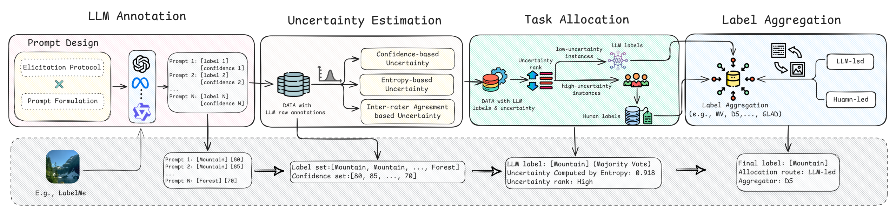
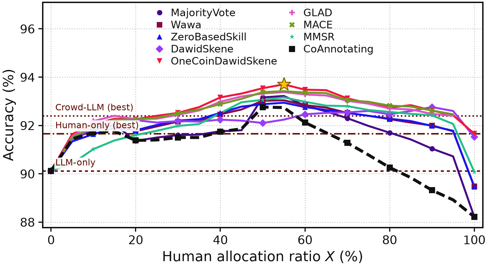
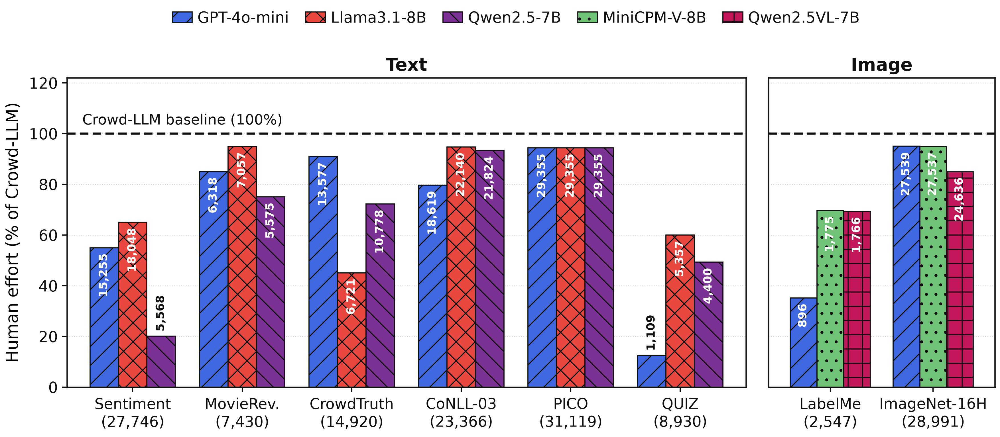

# MATCHA

**LLM-Assisted Task Allocation for Cost-Effective Human-AI Collaborative Annotation**

MATCHA decides, instance by instance, whether a label should come from a large language
model, from human annotators, or from both. It measures how uncertain the LLM is about each
instance, sends the most uncertain ones to the crowd, keeps the LLM's label everywhere else,
and resolves the routed instances with a label-aggregation model. This repository contains
the full pipeline, all 72 prompts, the processed annotation tables for eight crowdsourced
datasets, and every result table and figure reported in the paper.

## How it works

<p align="center">
  
  <br>
  <em>The framework of MATCHA.</em>
</p>

1. **LLM annotation.** Each instance is labelled under 9 prompting conditions: 3 elicitation
   protocols (Vanilla, chain-of-thought, Top-k) crossed with 3 prompt variants (the base
   instruction, a paraphrase, and a task-fitted structural manipulation). Decoding is greedy
   under a fixed seed, so disagreement between conditions comes from the prompt, not from
   sampling. Each response carries a label and a verbalized confidence.
2. **Uncertainty.** From the 9 labels and confidences, MATCHA scores each instance by
   *Self-Evaluation* (1 minus mean confidence), *Entropy* of the label distribution, or
   *Inter-rater Agreement* between conditions (Gini-Simpson).
3. **Allocation.** The top X% most uncertain instances go to the crowd; the rest keep the
   LLM's majority-vote label. Two routes: **Human-led** aggregates the crowd alone on routed
   instances, **LLM-led** adds the LLM as one extra annotator.
4. **Aggregation.** Routed instances are resolved by one of 8 crowd-kit aggregators
   (MajorityVote, DawidSkene, OneCoinDawidSkene, GLAD, MACE, MMSR, Wawa, ZeroBasedSkill),
   fitted on the routed subset only, so annotator reliability is never estimated from
   instances outside the pool.

## Results

Accuracy with GPT-4o-mini as the annotating model (best in **bold**). The full table, with
Llama3.1-8B and Qwen2.5-7B on text and MiniCPM-V-8B and Qwen2.5VL-7B on images, is in
[`results/summary.xlsx`](results/summary.xlsx) ([CSV](results/summary.csv)).

| Dataset | Human-only | LLM-only | Crowd-LLM | CoAnnotating | MATCHA |
|---|--:|--:|--:|--:|--:|
| Sentiment Polarity | 0.9166 | 0.9012 | 0.9240 | 0.9276 | **0.9370** |
| MovieReviews | 0.7924 | 0.7483 | 0.8231 | 0.7931 | **0.8304** |
| CrowdTruth RelEx | **0.7957** | 0.7845 | 0.7945 | 0.7882 | **0.7957** |
| CoNLL-2003 NER | 0.9418 | 0.9069 | 0.9498 | 0.9362 | **0.9503** |
| PICO | **0.9615** | 0.9406 | 0.9607 | 0.9607 | **0.9615** |
| QUIZ | 0.7226 | 0.8387 | 0.7613 | 0.8645 | **0.8774** |
| LabelMe | 0.7920 | 0.8140 | 0.8260 | 0.8280 | **0.8320** |
| ImageNet-16H | 0.8767 | 0.7973 | 0.8821 | 0.8733 | **0.8840** |

Across all 24 dataset-model pairs, MATCHA is strictly best in 17, ties the best baseline in 4
and trails it in 3.

**Baselines.** *Human-only*: best aggregator on the crowd alone. *LLM-only*: majority vote over
the 9 prompting conditions. *Crowd-LLM*: best aggregator on the crowd with the LLM added as one
annotator, on every instance. *CoAnnotating*: uncertainty-based routing with majority vote
([Li et al., EMNLP 2023](https://arxiv.org/abs/2310.15638)).

**Reading these numbers.** MATCHA's column is the best cell over its whole search space
(uncertainty basis, route, aggregator and budget X), evaluated on the same gold labels, so it
reports the best attainable accuracy rather than a fixed-budget operating point. The budget
is free, and several optima sit at high X. How much human effort each optimum needs is shown
separately:

<p align="center">
  
  <br>
  <em>Sentiment Polarity, GPT-4o-mini: accuracy as the share of instances routed to humans
  grows from 0% (LLM only) to 100% (crowd only). Each line is one aggregator; the star marks
  the best allocation.</em>
</p>

<p align="center">
  
  <br>
  <em>Human judgments needed at MATCHA's best accuracy, relative to Crowd-LLM, which sends
  every instance to the crowd.</em>
</p>

## Datasets

| Dataset | Task | Instances | Annotators | Source |
|---|---|--:|--:|---|
| Sentiment Polarity | binary sentiment | 4,999 | 203 | Rodrigues, Pereira & Ribeiro (2013) |
| MovieReviews | rating, binned to 3 classes | 1,498 | 135 | Rodrigues & Pereira, *Deep Learning from Crowds*, AAAI 2018 |
| CrowdTruth RelEx | medical relation extraction (cause, treat) | 975 sentences | 304 | Dumitrache, Aroyo & Welty, [CrowdTruth](https://doi.org/10.5281/zenodo.50676) |
| CoNLL-2003 NER | token-level NER (subsample) | 5,001 tokens | 47 | Rodrigues & Pereira, AAAI 2018 |
| PICO | participant-span detection (subsample) | 5,034 tokens | 50 | Nguyen et al., ACL 2017 |
| QUIZ | multiple-choice QA | 155 | 360 | Li, ICASSP 2024 (CC BY 4.0) |
| LabelMe | 8-way scene classification | 1,000 images | 59 | Rodrigues & Pereira, AAAI 2018 |
| ImageNet-16H | 16-way classification under 4 noise levels | 4,800 | 145 | Steyvers et al., PNAS 2022 |

[`datasets_pass/README.md`](datasets_pass/README.md) documents how each corpus was filtered
and recast, with the caveats that apply to each. [`eval/README.md`](eval/README.md) covers
the conversion into `task, worker, label` tables.

**What is included.** `eval/data/` holds the processed tables that every analysis reads:
`<name>_crowd.csv` (`task, worker, label`) and `<name>_gold.csv` (`task, true_label`). They
contain identifiers and labels only, no instance text or images. Annotator IDs are replaced
by pseudonyms (`w0001`, ...) that preserve the original sort order, so every aggregator
returns exactly the results of the original IDs. The raw corpora are not redistributed;
[`datasets/README.md`](datasets/README.md) lists where to obtain them. Please cite the
original datasets if you use these tables. If you are a dataset owner and would like a table
removed, please open an issue.

## Models

| Modality | Model | Served as |
|---|---|---|
| text + image | GPT-4o-mini | `gpt-4o-mini-2024-07-18` (OpenAI API) |
| text | Llama3.1-8B | `llama3.1:8b-instruct-q8_0` (Ollama) |
| text | Qwen2.5-7B | `qwen2.5:7b-instruct-q8_0` (Ollama) |
| image | MiniCPM-V-8B | `minicpm-v:8b-2.6-q8_0` (Ollama) |
| image | Qwen2.5VL-7B | `qwen2.5vl:7b-q8_0` (Ollama) |

All decoding settings and per-dataset output limits are in
[`supplementary/model_settings.json`](supplementary/model_settings.json), generated from the
code by `results/utils/build_supplementary.py`.

## Repository layout

```
matcha/
├── prompt/               72 prompt templates (8 datasets x 3 variants x 3 protocols) + builders
├── eval/
│   ├── convert/          raw corpora -> task/worker/label tables
│   ├── data/             processed crowd and gold tables (included)
│   ├── llm/              LLM generation (OpenAI, Ollama), scoring, uncertainty
│   ├── run_categorical.py    8 aggregators on the crowd alone
│   └── run_regression.py     MovieReviews on its continuous scale
├── results/
│   ├── utils/            every table and figure builder
│   ├── build_routing.py  the allocation sweep (uncertainty x route x aggregator x budget)
│   ├── RQ1/ RQ2/ RQ3/    paper tables and figures
│   ├── <dataset>/        per-dataset and per-model analysis
│   └── summary.csv/.xlsx the main results table
├── scripts/finalize.sh   scoring pipeline for one model
├── supplementary/        generation settings
├── datasets/             where to get the raw corpora (data not included)
└── build_datasets_pass.py    raw corpora -> filtered working set
```

## Setup

```bash
git clone https://github.com/ChanningZhangLGB/matcha.git && cd matcha
python3.11 -m venv .venv && source .venv/bin/activate
pip install -r requirements.txt
```

`scikit-learn` must stay below 1.6: crowd-kit 1.4.2's `Wawa` and `ZeroBasedSkill` fail under
1.6 and later.

## Reproducing the results

**Crowd-only aggregation** runs from the included tables:

```bash
python eval/run_categorical.py          # 8 aggregators x all tables -> eval/results/categorical.csv
python eval/run_regression.py           # MovieReviews, continuous track
```

**From the released LLM annotations.** The raw generations of all five models (about 19 MB
compressed) and the complete intermediate results are attached to the
[latest release](https://github.com/ChanningZhangLGB/matcha/releases/latest):

Scoring still reads a few files from the raw corpora (the PICO abstracts, to map predicted
spans onto tokens; the QUIZ source files; the MovieReviews ratings), so build
`datasets_pass/` first (see *Regenerating* below). After scoring, everything except
`build_budget.py` and the MovieReviews regression track reads only `eval/data/`,
`llm_output/` and `results/`.

```bash
tar -xzf llm_output.tar.gz              # -> llm_output/<model>/<variant>/<dataset>_<protocol>.jsonl
scripts/finalize.sh gpt-4o-mini --no-patch   # score, uncertainty, combined aggregation; repeat per model
python results/utils/build_uncertainty_splits.py gpt-4o-mini
bash results/utils/run_routing_sweep.sh <dataset> gpt-4o-mini    # 4 uncertainty bases x 2 routes
python results/utils/pivot_routing.py --all
python results/utils/build_allocation_best.py gpt-4o-mini
python results/utils/build_matcha_allocation.py
python results/utils/build_ca_annotating.py
```

To skip the sweep, extract `results_full.tar.gz` from the same release in the repository
root: it adds the per-instance uncertainty scores and routing splits that are not tracked in
git. The RQ figures are then rebuilt by the `build_rq2_*` and `build_rq3_*` scripts in
`results/utils/`, each of which documents its inputs at the top of the file. The routing
sweep re-fits every aggregator at every budget; GLAD and MACE dominate its runtime.

**Regenerating the LLM annotations** requires the raw corpora (see `datasets/README.md`),
then `python build_datasets_pass.py` and `python eval/convert/build_all.py`. Each run
covers one dataset and one prompt variant (`--group basic_instruction|control|customized`).
GPT-4o-mini reads `OPENAI_API_KEY` from the environment or from `config.env` (template:
[`config.env.example`](config.env.example)); open-weight models need a running
[Ollama](https://ollama.com) server with the tags above.

```bash
python eval/llm/run_openai.py sentiment --group control             # 3 protocols; resumable
python eval/llm/run_ollama.py llama3.1:8b-instruct-q8_0 sentiment --group control
```

## Citation

The paper is under review. A BibTeX entry will be added here once it is published.

## License

The code is released under the [MIT License](LICENSE). The processed annotation tables in
`eval/data/` derive from the datasets listed above and remain subject to their original
terms.
